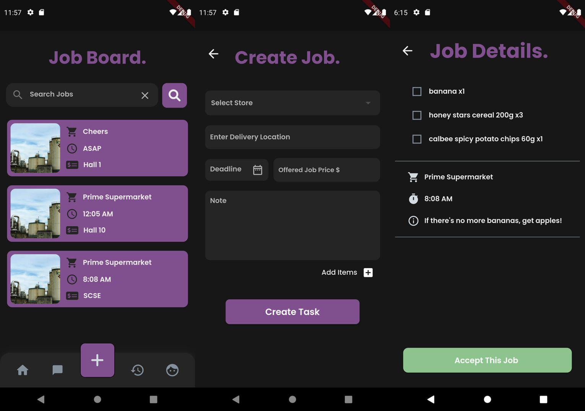

# uGrab v1

## App Description:

Are you tired of spending precious time commuting, waiting in line, and then commuting back just for a quick meal or simple purchase? If you'd rather focus on more important tasks and avoid the hassle of leaving your room, we have the perfect solution for you!

Introducing uGrab, a delivery service mobile app designed specifically for NTU students. Our platform enables you to post item purchase and delivery requests or accept such tasks from your fellow students.

uGrab's mission is to address the challenges faced by students who need to buy something urgently but cannot do so themselves due to time constraints, inconvenience, or other reasons. By connecting students with one another, we make it easy for you to get the items you need while empowering others to help you out. Experience the convenience of uGrab and revolutionize the way you shop on campus!

## Tools and Frameworks:

This app is developed in flutter, with firebase database integration.
